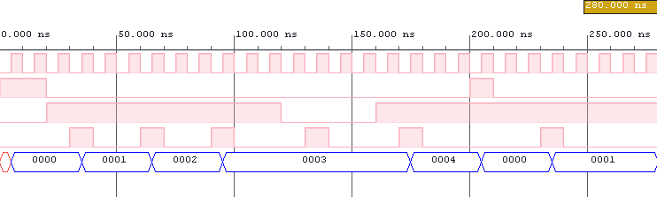
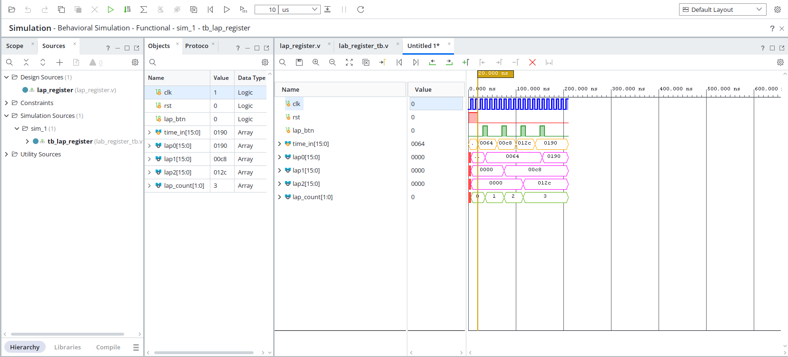

# **Digital Stopwatch with Lap (Verilog)**
 
## **Team Members**

- Aktilek Abylaikyzy 

- Htet Oo Khin 

- Zar Ni Tun


## **Project Description**

This project implements a **digital stopwatch with lap functionality** on the Nexys A7 FPGA board using Verilog.

The stopwatch measures time and displays it on a **seven-segment display**. Users can start/stop the timer, reset it, and store a lap value.

### **Features**

- Start / Stop control

- Reset functionality

- Lap time capture

- Real-time display on 7-segment display
---

### **Top-Level I/O Ports**

| **Port name** | **Direction** | **Type** | **Description** |
|:------------:|:----------:|:----------:|:----------:|
| `clk`        | input     | `wire`     | Main clock      |
| `btnd`       | input     | `wire`     | Start / Stop     |
| `btnu`       | input     | `wire`     | Reset button     |
| `btnr`       | input     | `wire`     | Lap button     |
| `btnl`       | input     | `wire`     | Display stored values button |
| `seg[6:0]`    | output     | `wire [6:0]`     | Seven-segment cathodes      |
| `an[7:0]`    | output     | `wire [7:0]`     | Seven-segment anodes     |
| `dp`         | output     | `wire`     | Decimal point     |


## **System Architecture**

The system is organized as a modular design:

- `clk_en` → generates a slower clock for timing
- `debounce` → processes button inputs and removes noise
- `stopwatch_counter` → tracks elapsed time
- `lap_register` → stores captured lap values
- `display_driver` → controls the 7-segment display
- `top` → connects all modules together

## **Parameter Definition**
```
N = 32
CLK_FREQ = 100_000_000
MAX = 1_000_000
TICK_MS = 10
```
**Description**

- `N` – Bit-width of time and lap counters (`time[N-1:0]`, `lap[N-1:0]`)
- `CLK_FREQ` – FPGA system clock frequency (100 MHz)
- `MAX` – Clock divider value used to generate a 10 ms enable pulse
- `TICK_MS` – Time resolution of the stopwatch (each count = 10 ms)


### **Data Flow**

Buttons → Debouncer → Control Logic → Counter → Display Driver → 7-Segment Display


## **System Overview**

The system is composed of several modules responsible for:

- Clock division
- Input processing (debouncing)  
- Time counting  
- Display control


## **Block Diagram**


## **Block Diagram Explanation**
 
#### STEP 1 — clk (Main Clock)
 
The `clk` signal enters from the left.
It is the **100 MHz** system clock from the FPGA board — it ticks 100 million times per second.
 
It fans out to **every single module** — you can see it branch at the junction dots (●) and reach `clk_en`, `debouncer`, `stopwatch_counter`, `lap_register`, and `display_driver`.
 
---
 
#### STEP 2 — clk_en (Clock Divider)
 
100 MHz is **way too fast** to count human time directly.
 
`clk_en` counts up to **1,000,000** then fires a single pulse called `en_10ms`.
 
```
100,000,000 ÷ 1,000,000 = 100 pulses/sec → one pulse every 10ms
```
 
This `en_10ms` signal is sent to `debouncer`, `stopwatch_counter`, and `display_driver` so they all tick at the same slow rate.
 
---
 
#### STEP 3 — Buttons (Raw Input)
 
Four buttons enter from the left:
 
| Button | Function |
|:------:|:--------:|
| `btnd` | Start / Stop |
| `btnu` | Reset |
| `btnr` | Capture lap |
| `btnl` | Switch display to lap view |
 
---
 
#### STEP 4 — debouncer (Button Cleaner)
 
The `debouncer` samples each button every **10ms** (using `en_10ms`).
 
By only checking once every 10ms, the bounce noise is ignored and you get a **clean single pulse** per press.
 
Output signals:
- `start_stop` → to counter's `en`
- `rst_btn` → to counter's `rst`
- `lap_btn` → to lap register
- `disp_btn` → to display driver
 
---
 
#### STEP 5 — stopwatch_counter (Time Tracker)
 
This module tracks elapsed time using a counter of width `N` bits.
- `time[N-1:0]` → current time value
- `N = 32` (parameter defining counter size)

The counter increments on every `en_10ms` pulse:
 
| Signal | Condition | Effect |
|:------:|:---------:|:------:|
| `en = 1` | start_stop active | counting |
| `en = 0` | — | paused |
| `rst = 1` | — | reset to zero |
 
Each increment corresponds to **10 ms**, so total time is:
```
time × 10 ms
```
The `time[N-1:0]` signal is sent to:
- display_driver
- lap_register
 
---
 
#### STEP 6 — lap_register (Lap Memory)
 
When you press `btnr`, the debouncer fires `lap_btn`.
 
The `lap_register` **freezes a copy** of the current `time[N-1:0]` value and holds it as `lap[N-1:0]`.
 
The main counter **keeps running** — the lap register just takes a snapshot.
 
The stored lap value is sent to the `display_driver` and shown when `disp_btn` is pressed.
 
---
 
#### STEP 7 — display_driver (7-Segment Output)
 
The `display_driver` receives both `time[N-1:0]` and `lap[N-1:0]`.
 
| `disp_btn` | Display shows |
|:----------:|:-------------:|
| `0` | Live running time |
| `1` | Stored lap time |
 
It converts the binary number to **decimal digits** and drives the display by:
- Cycling `an[7:0]` — selecting which digit is ON
- Setting `seg[6:0]` — which segments light up (a–g)
- `dp` — decimal point between seconds and ms
 
---

## **Simulation and Verification**

Simulation was performed in  Vivado to verify the functionality of the **newly developed modules**.

> Note: Only the `stopwatch_counter` and `lap_register` modules were simulated in this lab.  
> Other modules (`clk_en`, `debounce`, `display_driver`) were reused from previous labs without modification and were already verified earlier.

---

### **Simulation Approach**

The following modules were tested using testbenches from the `sim/` directory:

`stopwatch_counter`
- Verified correct counting behavior with `en_10ms`
- Tested **start/stop functionality**
- Confirmed **reset behavior**
- Ensured correct time increments (10 ms resolution)

`lap_register`
- Verified correct capture of time value on `lap_btn`
- Confirmed stored value remains constant after capture
- Ensured independence from the running counter

---

### **Simulation Results**

[Stopwatch Counter Simulation](sim/stopwatch_counter_tb.v)  



- Counter increments when `en = 1`  
- Counter holds value when `en = 0`  
- Reset (`rst = 1`) clears the counter to `0000`  
- Counting resumes correctly after reset  

---

[Lap Register Simulation](sim/lap_register_tb.v)



- Lap values are captured on each `lap_btn` pulse  
- `lap0`, `lap1`, and `lap2` store consecutive snapshots of `time_in`  
- `lap_count` increments with each capture (0 → 3)  
- Stored values remain stable after being written  


---

### **Summary**

Simulation confirms that the `stopwatch_counter` and `lap_register` modules behave according to specification and are ready for integration.

## **Project Structure**

- `docs/`   → Block diagrams and documentation
- `sim/`    → Testbenches for simulation
- `src/`    → Verilog source files
- `xdc/`    → Constraint files for Nexys A7  

  


## **Lab 1 Goals: Architecture**

1. Set up GitHub repository
2. Define system architecture
3. Create block diagram
4. Prepare XDC constraints file
5. Initialize project structure


## **Lab 2 Goals: Unit Design**

1. Develop individual modules
2. Implement core unit functionality
3. Create and run testbenches
4. Verify modules through simulation
5. Debug and refine unit behavior
6. Commit progress and updates to Git

## Lab 3 Goals: Integration
1. Integrate individual modules into the top-level entity
2. Establish interconnections between all components
3. Perform synthesis of the complete design
4. Run initial hardware testing and validation
5. Identify and resolve integration issues
6. Commit progress and updates to Git in GitHub

## Lab 4 Goals: Tuning
1. Debug system behavior
2. Identify performance and timing issues
3. Optimize code and resource usage
4. Fix bugs from integration
5. Validate improvements through testing
6. Refine and clean up codebase
7. Document changes in Git
8. Commit progress and updates to GitHub
